_Last updated 2026-06-15 by overnight automation (toolkit v1.0.0). Review before relying on it._

# Architecture — VictoriaTracker

```mermaid
flowchart TD
    USER["Victoria / Drew<br/>browser · installed PWA"]

    subgraph GHP["GitHub Pages — static host"]
        direction TB
        IDX["index.html<br/>entry point · wires all modules<br/>weekly report popup host"]
        SW["sw.js<br/>service worker · offline cache"]
        MAN["manifest.json<br/>PWA install metadata"]

        subgraph CORE["Core/ — pure logic (no DOM)"]
            direction TB
            CFG["config.js<br/>all keys · Firestore paths · constants<br/>Google Calendar client ID"]
            STATE["state.js<br/>in-memory app state"]
            FBWRAP["firebase.js<br/>readDoc · writeDoc · watchDoc"]
            HAB["habits.js + habits-data.js<br/>tier logic · Firestore CRUD · onSnapshot"]
            FEAT["stars.js · streaks.js · cycles.js<br/>events.js · period.js · rooms.js"]
            HIST["history.js<br/>weekly snapshots"]
            SECORD["section-order.js<br/>today-view layout · persisted + live-synced"]
            PLAN["planning.js<br/>weekly plan-ahead · intent only<br/>never touches habit.history"]
            CAL["calendar.js<br/>calendar events data layer<br/>eventsByDay · busyDays · eventCounts"]
        end

        subgraph UI["web/ui/ — DOM rendering"]
            direction TB
            RENDER["render.js<br/>main render loop · tab nav · balance display"]
            UIMOD["habits-ui · shop-ui · period-ui<br/>rooms-ui · events-ui · history-ui<br/>manage-ui · animations · lucky-draw"]
            PLANUI["planning-ui.js<br/>Planning tab: habit grid × 7 bubbles<br/>tier-colored intent · agenda · copy-prev-week"]
            GCALUI["google-calendar.js<br/>GIS token flow · fetches 4-week window<br/>writes events to Firestore CALENDAR doc"]
        end
    end

    subgraph CDN["CDNs — runtime dependencies"]
        FSDK["Firebase SDK v10.7.1<br/>gstatic.com"]
        CHARTJS["Chart.js 4.4.1<br/>cdn.jsdelivr.net"]
        SORTABLE["SortableJS 1.15.2<br/>cdn.jsdelivr.net"]
        CONFETTI["canvas-confetti 1.9.3<br/>cdn.jsdelivr.net"]
        EJSCDN["EmailJS browser SDK<br/>cdn.jsdelivr.net"]
        FONTS["Google Fonts<br/>Playfair Display · Montserrat · Great Vibes"]
        GIS["Google Identity Services<br/>accounts.google.com/gsi/client<br/>OAuth token flow · no redirect"]
    end

    subgraph FIREBASE["Firebase — Firestore"]
        direction TB
        FS["Firestore DB<br/>project: victoria-tracker-1d2ab"]
        DOCS["system/ collection<br/>habits_list · weekly_history · star_data<br/>seasonal_events · period_data<br/>rooms_data · reset_state · ui_config<br/>weekly_plans · calendar_events"]
    end

    subgraph GHA["GitHub Actions — weekly automation"]
        direction TB
        CRON["weekly-reset.yml<br/>cron: Mon 09:00 UTC (4 AM Central)"]
        RESET["scripts/reset.js<br/>Node 22 · node-fetch · Firestore REST API<br/>scores habits · awards stars + bounties<br/>saves snapshot · resets counters<br/>advances cycleNextDue + room streaks<br/>advances event payout watermark"]
    end

    EMAILJS["EmailJS<br/>weekly summary email to Drew"]
    OWM["OpenWeatherMap API<br/>current temp + conditions"]
    OPENUV["OpenUV API<br/>UV index"]
    GCAL_API["Google Calendar API<br/>primary calendar events · read-only"]
    LS["localStorage<br/>UI state: collapsed sections · sort lock<br/>filter mode · priority mode<br/>report mute flag (per device · per week)"]

    USER -->|"opens app"| IDX
    IDX --> SW
    IDX --> MAN
    IDX -->|"imports"| CFG
    IDX -->|"imports"| STATE
    IDX -->|"imports"| HAB
    IDX -->|"imports"| SECORD
    IDX -->|"imports"| PLAN
    IDX -->|"imports"| CAL
    IDX -->|"imports"| UIMOD
    IDX -->|"imports"| PLANUI
    IDX -->|"imports"| GCALUI

    STATE --> FBWRAP
    HAB --> FBWRAP
    FEAT --> FBWRAP
    HIST --> FBWRAP
    SECORD --> FBWRAP
    PLAN -->|"watchDoc / writeDoc"| FBWRAP
    CAL -->|"watchDoc / writeDoc"| FBWRAP
    FBWRAP -->|"uses"| FSDK
    FBWRAP <-->|"read / write /<br/>live onSnapshot"| FS
    FS --- DOCS

    HIST -->|"renders charts"| CHARTJS
    UIMOD -->|"drag reorder"| SORTABLE
    UIMOD -->|"confetti fanfare"| CONFETTI
    UIMOD -->|"sends test report"| EJSCDN
    EJSCDN -->|"HTTPS POST"| EMAILJS
    RENDER --> UIMOD
    RENDER --> PLANUI
    CORE --> RENDER

    PLANUI -->|"reads plan + calendar state"| PLAN
    PLANUI -->|"reads calendar state"| CAL
    GCALUI -->|"GIS sign-in"| GIS
    GIS -->|"OAuth token"| GCAL_API
    GCALUI -->|"writes fetched events"| CAL
    GCAL_API -->|"calendar events JSON"| GCALUI

    UIMOD -->|"reads/writes"| LS
    IDX -->|"loads"| FONTS

    UIMOD -->|"weather request"| OWM
    UIMOD -->|"UV request"| OPENUV

    CRON -->|"triggers"| RESET
    RESET -->|"Firestore REST API<br/>scores · resets · snapshots"| FS
    RESET -->|"sends weekly report email"| EMAILJS

    classDef app fill:#dbeafe,stroke:#2563eb,color:#0c1844;
    classDef store fill:#dcfce7,stroke:#16a34a,color:#052e16;
    classDef ext fill:#fce7f3,stroke:#db2777,color:#500724;
    classDef auto fill:#ede9fe,stroke:#7c3aed,color:#1e1b4b;

    class USER,IDX,SW,MAN,CFG,STATE,FBWRAP,HAB,FEAT,HIST,SECORD,PLAN,CAL,RENDER,UIMOD,PLANUI,GCALUI app;
    class FS,DOCS,LS store;
    class FSDK,CHARTJS,SORTABLE,CONFETTI,EJSCDN,FONTS,GIS,EMAILJS,OWM,OPENUV,GCAL_API ext;
    class CRON,RESET auto;
```

**Legend.** Blue nodes are the app's own code: `index.html` (the sole entry point, which also hosts the interactive weekly report popup overlay), the `Core/` ES modules that handle all data and business logic (including `section-order.js` for the drag-reorderable today-view layout, `planning.js` for weekly intent plans, and `calendar.js` for calendar event storage and querying), and the `web/ui/` modules that render the DOM — including `planning-ui.js` (the Planning tab's habit grid, tier-colored intent bubbles, and calendar agenda) and `google-calendar.js` (the Google Identity Services OAuth flow that fetches events from Google Calendar and writes them to Firestore). Green nodes are data stores: Firestore (cloud, ten documents in the `system` collection — `habits_list`, `weekly_history`, `star_data`, `seasonal_events`, `period_data`, `rooms_data`, `reset_state`, `ui_config`, `weekly_plans`, and `calendar_events`) and `localStorage` (browser, holding UI preferences and per-device/per-week report mute flags). Pink nodes are everything the app calls at runtime from the outside world — CDN libraries, Firebase's own SDK, Google Identity Services for Calendar OAuth, the Google Calendar API, the EmailJS relay service, and the OpenWeatherMap and OpenUV APIs that power the header weather card. Purple nodes are the automated weekly reset: a GitHub Actions cron job that runs `scripts/reset.js` every Monday at 09:00 UTC, scoring the previous week via the Firestore REST API (not `firebase-admin`), awarding stars and bounties, advancing cyclic habit due dates, advancing room-check streaks, advancing the seasonal event payout watermark, saving a history snapshot, resetting all habit counters, and sending the weekly email report — all without anyone opening the app. On the next app open after a reset, the browser detects the new reset date and auto-shows the interactive report popup once per device.
