_Last updated 2026-07-21 by overnight automation (toolkit v1.0.0). Review before relying on it._

# Architecture — VictoriaTracker

```mermaid
flowchart TD
    USER["Victoria / Drew<br/>browser · installed PWA"]

    subgraph GHP["GitHub Pages — static host"]
        direction TB
        IDX["index.html<br/>entry point · wires all modules<br/>weekly report popup host"]
        SW["sw.js<br/>service worker · offline cache (v26)"]
        MAN["manifest.json<br/>PWA install metadata"]

        subgraph CORE["Core/ — pure logic (no DOM)"]
            direction TB
            CFG["config.js<br/>all keys · Firestore paths · constants<br/>Google Calendar client ID<br/>LUCKY_DRAW_ODDS (per-tier %)"]
            STATE["state.js<br/>in-memory app state"]
            FBWRAP["firebase.js<br/>readDoc · writeDoc · watchDoc"]
            HAB["habits.js + habits-data.js<br/>tier logic · Firestore CRUD · onSnapshot<br/>NaN guard on val fields"]
            WRESET["weeklyReset.js<br/>proposeWeeklyReset() · executeWeeklyReset()<br/>shared by GitHub Action + planned in-app approval<br/>injected io={readDoc,writeDoc} adapter"]
            FEAT["stars.js<br/>balance · excuse/streak-reset/mark-off tokens<br/>shop items · star log"]
            FEAT2["streaks.js · cycles.js · events.js<br/>period.js · rooms.js"]
            HIST["history.js<br/>weekly snapshots"]
            SECORD["section-order.js<br/>today-view layout · persisted + live-synced"]
            PLAN["planning.js<br/>weekly plan-ahead · intent only<br/>never touches habit.history"]
            CAL["calendar.js<br/>calendar events data layer<br/>eventsByDay · busyDays · eventCounts"]
        end

        subgraph UI["web/ui/ — DOM rendering"]
            direction TB
            RENDER["render.js<br/>main render loop · tab nav<br/>switchWeeklySub(): Overview vs. Plan<br/>handleManageClick(): passcode gate"]
            HISTUI["history-ui.js<br/>5 sub-tabs: Balance · Heatmap · Top Earners<br/>By Category · ⚙ Settings<br/>Settings: View Report · Customize Vibe · Daily Reminder"]
            UIMOD["habits-ui · shop-ui · period-ui<br/>rooms-ui · events-ui · animations<br/>lucky-draw (tier-scaled odds)"]
            MANAGEUI["manage-ui.js<br/>split-panel (passcode 1234)<br/>sections: Habits · Add · Events · Stars<br/>Period · Layout · Streak $<br/>weekly report popup · forecast"]
            PLANUI["planning-ui.js<br/>Plan sub-tab (within Weekly tab)<br/>habit grid × 7 bubbles · tier-colored intent<br/>agenda · copy-prev-week"]
            GCALUI["google-calendar.js<br/>GIS token flow · fetches 4-week window<br/>writes events to Firestore CALENDAR doc<br/>(silent auto-sync only; no connect UI)"]
        end
    end

    subgraph CDN["CDNs — runtime dependencies"]
        FSDK["Firebase SDK v10.7.1<br/>gstatic.com"]
        CHARTJS["Chart.js 4.4.1<br/>cdn.jsdelivr.net"]
        SORTABLE["SortableJS 1.15.2<br/>cdn.jsdelivr.net"]
        CONFETTI["canvas-confetti 1.9.3<br/>cdn.jsdelivr.net"]
        EJSCDN["EmailJS browser SDK<br/>cdn.jsdelivr.net<br/>(loaded but inactive — send not called)"]
        FONTS["Google Fonts<br/>Playfair Display · Montserrat · Great Vibes<br/>fonts.googleapis.com"]
        GIS["Google Identity Services<br/>accounts.google.com/gsi/client<br/>OAuth token flow · no redirect"]
    end

    subgraph FIREBASE["Firebase — Firestore"]
        direction TB
        FS["Firestore DB<br/>project: victoria-tracker-1d2ab"]
        DOCS["system/ collection<br/>habits_list · weekly_history<br/>star_data (balance · excuseTokens · streakResetTokens · markOffTokens)<br/>seasonal_events · period_data<br/>rooms_data · reset_state (pendingReset · lastWeeklyReset)<br/>ui_config · weekly_plans · calendar_events"]
    end

    subgraph GHA["GitHub Actions — weekly automation"]
        direction TB
        CRON_P["weekly-reset.yml<br/>Mon 09:00 UTC (4 AM Central)<br/>RESET_MODE=propose"]
        CRON_F["weekly-reset.yml<br/>Tue 00:00 UTC (7 PM Central Mon)<br/>RESET_MODE=force"]
        ADAPT["scripts/reset.js<br/>Node 22 · node-fetch<br/>Firestore REST io adapter<br/>delegates to Core/weeklyReset.js"]
    end

    OWM["OpenWeatherMap API<br/>current temp + conditions"]
    OPENUV["OpenUV API<br/>UV index"]
    GCAL_API["Google Calendar API<br/>primary calendar events · read-only"]
    LS["localStorage<br/>UI state: collapsed sections · sort lock<br/>filter mode · priority mode<br/>report mute flag (per device · per week)<br/>gcalConnected flag (triggers silent auto-sync)<br/>vt_vibeHue · vt_vibeSat (accent color override)<br/>vt_reminderEnabled · vt_reminderTime (daily notification)"]

    USER -->|"opens app"| IDX
    IDX --> SW
    IDX --> MAN
    IDX -->|"imports"| CFG
    IDX -->|"imports"| STATE
    IDX -->|"imports"| HAB
    IDX -->|"imports"| FEAT
    IDX -->|"imports"| SECORD
    IDX -->|"imports"| PLAN
    IDX -->|"imports"| CAL
    IDX -->|"imports"| UIMOD
    IDX -->|"imports"| PLANUI
    IDX -->|"imports"| GCALUI

    STATE --> FBWRAP
    HAB --> FBWRAP
    FEAT --> FBWRAP
    FEAT2 --> FBWRAP
    HIST --> FBWRAP
    SECORD --> FBWRAP
    PLAN -->|"watchDoc / writeDoc"| FBWRAP
    CAL -->|"watchDoc / writeDoc"| FBWRAP
    FBWRAP -->|"uses"| FSDK
    FBWRAP <-->|"read / write /<br/>live onSnapshot"| FS
    FS --- DOCS

    HISTUI -->|"renders charts"| CHARTJS
    UIMOD -->|"drag reorder"| SORTABLE
    UIMOD -->|"confetti fanfare"| CONFETTI
    IDX -->|"SDK init only<br/>(send inactive)"| EJSCDN
    RENDER --> UIMOD
    RENDER --> HISTUI
    RENDER --> PLANUI
    RENDER --> MANAGEUI
    CORE --> RENDER

    PLANUI -->|"reads plan + calendar state"| PLAN
    PLANUI -->|"reads calendar state"| CAL
    GCALUI -->|"silent GIS sign-in<br/>if gcalConnected set"| GIS
    GIS -->|"OAuth token"| GCAL_API
    GCALUI -->|"writes fetched events"| CAL
    GCAL_API -->|"calendar events JSON"| GCALUI

    UIMOD -->|"reads/writes"| LS
    HISTUI -->|"reads/writes vibe + reminder"| LS
    GCALUI -->|"reads/writes gcalConnected"| LS
    IDX -->|"loads"| FONTS

    UIMOD -->|"weather request"| OWM
    UIMOD -->|"UV request"| OPENUV

    CRON_P -->|"triggers propose"| ADAPT
    CRON_F -->|"triggers force"| ADAPT
    ADAPT -->|"calls proposeWeeklyReset<br/>or executeWeeklyReset"| WRESET
    WRESET -->|"Firestore REST API<br/>scores · resets · snapshots"| FS

    classDef app fill:#dbeafe,stroke:#2563eb,color:#0c1844;
    classDef store fill:#dcfce7,stroke:#16a34a,color:#052e16;
    classDef ext fill:#fce7f3,stroke:#db2777,color:#500724;
    classDef auto fill:#ede9fe,stroke:#7c3aed,color:#1e1b4b;

    class USER,IDX,SW,MAN,CFG,STATE,FBWRAP,HAB,WRESET,FEAT,FEAT2,HIST,SECORD,PLAN,CAL,RENDER,HISTUI,UIMOD,MANAGEUI,PLANUI,GCALUI,ADAPT app;
    class FS,DOCS,LS store;
    class FSDK,CHARTJS,SORTABLE,CONFETTI,EJSCDN,FONTS,GIS,OWM,OPENUV,GCAL_API ext;
    class CRON_P,CRON_F auto;
```

**Legend.** Blue nodes are the app's own code: `index.html` (the sole entry point, which also hosts the interactive weekly report popup overlay), the `Core/` ES modules that handle all data and business logic — including `config.js` (all keys, Firestore paths, and constants including `LUCKY_DRAW_ODDS` which defines per-tier lucky draw probabilities: Debt 2%, Low 5%, Goal 7%, Bonus 10%), `weeklyReset.js` (the single implementation of the Monday reset, shared between the GitHub Action and the planned in-app approval flow via an injected `io` adapter), `habits.js + habits-data.js` (tier math, Firestore CRUD, and a NaN guard that prevents cleared input fields from corrupting payout values), `stars.js` (star balance plus all three token types: excuse tokens, streak reset tokens, and mark-off tokens), `section-order.js` (drag-reorderable today-view layout), `planning.js` (weekly intent plans), and `calendar.js` (calendar event storage and querying) — the `web/ui/` modules that render the DOM, including `render.js` (tab navigation and the `switchWeeklySub()` toggle between Overview and Plan, plus the passcode-gated `handleManageClick()` that reveals the Manage panel), `history-ui.js` (five chart sub-tabs — Balance, Heatmap, Top Earners, By Category, and ⚙ Settings — where the Settings sub-tab exposes View Report, Customize Vibe hue/saturation sliders, and a Daily Reminder notification toggle, all without a passcode), `manage-ui.js` (the split-panel settings area behind passcode `1234`, with left-nav sections for Habits, Add Habit, Events, Stars, Period, Layout, and Streak $, plus the weekly report popup logic and forecast computation), `planning-ui.js` (the Plan sub-tab's habit grid, tier-colored intent bubbles, and calendar agenda), the `habits-ui · shop-ui · period-ui · rooms-ui · events-ui · animations · lucky-draw` cluster (habit card rendering, bubble toggle with tier-scaled lucky draw, token flows, shop redemption with balance guard, period start/end with backdate support, room checks, seasonal events, and animations), `google-calendar.js` (which silently re-fetches a 4-week calendar window using Google Identity Services OAuth on page load if the device has previously connected, writing events to Firestore — there is currently no connect button in the UI), and `scripts/reset.js` (a thin Node.js adapter that provides the Firestore REST `io` object and calls `proposeWeeklyReset` or `executeWeeklyReset` from `Core/weeklyReset.js` depending on `RESET_MODE`). Green nodes are data stores: Firestore (cloud, ten documents in the `system` collection — `habits_list`, `weekly_history`, `star_data` which tracks `excuseTokens`, `streakResetTokens`, and `markOffTokens` in addition to balance and shop items, `seasonal_events`, `period_data`, `rooms_data`, `reset_state` which includes `pendingReset`/`pendingSince`/`snoozeCount`/`snoozedUntil` for the two-phase flow, `ui_config`, `weekly_plans`, and `calendar_events`) and `localStorage` (browser, holding UI preferences, the per-device/per-week report mute flag, the `gcalConnected` flag that triggers silent Google Calendar auto-sync, and the Customize Vibe overrides `vt_vibeHue`/`vt_vibeSat` plus Daily Reminder settings `vt_reminderEnabled`/`vt_reminderTime`). Pink nodes are everything the app calls at runtime from the outside world — CDN libraries (Firebase SDK, Chart.js, SortableJS, canvas-confetti, and the EmailJS browser SDK which is loaded but whose `send()` is not currently called), Google Fonts, Google Identity Services for Calendar OAuth, the Google Calendar API, and the OpenWeatherMap and OpenUV APIs that power the header weather card. Purple nodes are the automated weekly reset: two GitHub Actions cron runs every Monday — a "propose" run at 09:00 UTC (4 AM Central) that only flips `pendingReset = true` in Firestore (making no data changes, giving Victoria time to fix last week's data), and a "force" run at 00:00 UTC Tuesday (7 PM Central Monday) that calls `executeWeeklyReset` via `Core/weeklyReset.js` if she never approved in-app, scoring the week, awarding stars and bounties, advancing cyclic habit due dates and room-check streaks, advancing the seasonal event payout watermark, saving a history snapshot, and resetting all habit counters — all via the Firestore REST API (not `firebase-admin`). On the next app open after a reset, the browser detects the new `lastWeeklyReset` date and auto-shows the interactive report popup once per device; the same report is accessible at any time via History → ⚙ Settings → View Report.
