_Last updated 2026-08-25 by overnight automation (toolkit v1.0.0). Review before relying on it._

# Architecture — VictoriaTracker

```mermaid
flowchart TD
    USER["Victoria / Drew<br/>browser · installed PWA"]

    subgraph GHP["GitHub Pages — static host"]
        direction TB
        IDX["index.html<br/>entry point · wires all modules<br/>weekly report popup host"]
        SW["sw.js<br/>service worker · offline cache (v40)"]
        MAN["manifest.json<br/>PWA install metadata"]

        subgraph CORE["Core/ — pure logic (no DOM)"]
            direction TB
            CFG["config.js<br/>all keys · Firestore paths · constants<br/>LUCKY_DRAW_ODDS (per-tier %)<br/>TIER_LABELS (uppercase) · TIER_DOTS (email codes)<br/>WATER_CONFIG (dailyGoalOz · incrementOz · linkedHabitId)"]
            STATE["state.js<br/>in-memory app state<br/>habits · stars · history · plans · calendar<br/>waterData · achievements · resetState · categoryConfig"]
            FBWRAP["firebase.js<br/>readDoc · writeDoc · watchDoc<br/>mergeDoc · increment"]
            HAB["habits.js + habits-data.js<br/>tier logic · Firestore CRUD · onSnapshot · NaN guard<br/>weekTotal() / toCumulative() — per-day history helpers"]
            WRESET["weeklyReset.js<br/>proposeWeeklyReset() · executeWeeklyReset()<br/>resetAlreadyHandledToday() — idempotency check<br/>injected io={readDoc,writeDoc} adapter<br/>runs in both browser + Node (GitHub Action)"]
            RSTATE["resetState.js<br/>reads/watches system/reset_state<br/>effectiveDate() — pins UI to pending week<br/>isResetOverdue() · isResetPromptDue()<br/>snoozeWeeklyReset() (2×15 min)"]
            WATER["water.js<br/>daily ounce logging · system/water_data<br/>addWater() / undoWater() — field-level increments<br/>syncWaterHabit() — auto-fills linked habit<br/>computeWaterStreak()"]
            ACH["achievements.js<br/>permanent badges · system/achievements_data<br/>watchAchievements() · unlockAchievement() (idempotent)"]
            FEAT["stars.js<br/>balance · Rest Week / Fresh Start / Day Pass tokens<br/>shop items · star log"]
            FEAT2["streaks.js · cycles.js · events.js<br/>period.js · rooms.js"]
            HIST["history.js<br/>weekly snapshots"]
            SECORD["section-order.js<br/>today-view layout · persisted + live-synced"]
            PLAN["planning.js<br/>weekly plan-ahead · intent only<br/>never touches habit.history"]
            CAL["calendar.js<br/>calendar events data layer"]
            CATPAY["category-payouts.js<br/>category-wide payout MATH<br/>pure — no Firebase import<br/>computeCategoryResult() · blockersForRank()<br/>TIER_LABEL (title-case) · formatReward()"]
            CATCFG["category-config.js<br/>Firestore load/watch/save<br/>for system/category_config"]
        end

        subgraph UI["web/ui/ — DOM rendering"]
            direction TB
            RENDER["render.js<br/>main render loop · tab nav<br/>switchWeeklySub(): Overview vs. Plan<br/>handleManageClick(): passcode gate<br/>tappable ⭐ star badge per habit card"]
            WATERUI["water-ui.js<br/>Today-tab water card (above sections)<br/>animated SVG vessel fill<br/>taps → addWater() / undoWater()<br/>vessel picker → localStorage waterVessel"]
            VESSEL["vessel-geometry.js<br/>SVG path data for 5 vessel shapes<br/>(glass · bottle · tumbler · wine · pool)<br/>pure data — no DOM"]
            HISTUI["history-ui.js<br/>5 sub-tabs: Balance · Heatmap · Top Earners<br/>By Category · ⚙ Settings<br/>Settings: View Report · Customize Vibe · Daily Reminder"]
            ACHUI["achievements-ui.js<br/>unlock checks (perfect month · earnings · water)<br/>badge grid in Manage → Achievements"]
            ACHCAT["achievement-catalog.js<br/>static badge definitions<br/>synced IDs with native app"]
            UIMOD["habits-ui · shop-ui · period-ui<br/>rooms-ui · events-ui · animations<br/>lucky-draw (tier-scaled odds)<br/>animations: perfect-week + streak milestone unlocks"]
            MANAGEUI["manage-ui.js<br/>split-panel (passcode 1234)<br/>sections: Habits · Add · Events · Stars<br/>Period · Layout · Streak $ · Achievements · Category<br/>weekly report popup · forecast"]
            PLANUI["planning-ui.js<br/>Plan sub-tab (within Weekly tab)<br/>habit grid × 7 bubbles · tier-colored intent<br/>agenda · copy-prev-week"]
            GCALUI["google-calendar.js<br/>GIS token flow · fetches 4-week window<br/>writes events to Firestore CALENDAR doc<br/>(silent auto-sync only; no connect UI)"]
        end
    end

    subgraph CDN["CDNs — runtime dependencies"]
        FSDK["Firebase SDK v10.7.1<br/>gstatic.com"]
        CHARTJS["Chart.js 4.4.1<br/>cdn.jsdelivr.net"]
        SORTABLE["SortableJS 1.15.2<br/>cdn.jsdelivr.net"]
        CONFETTI["canvas-confetti 1.9.3<br/>cdn.jsdelivr.net"]
        EJSCDN["EmailJS browser SDK<br/>cdn.jsdelivr.net<br/>(loaded but inactive — send not called)"]
        FONTS["Google Fonts<br/>Playfair Display · Montserrat · Great Vibes<br/>fonts.googleapis.com"]
        GIS["Google Identity Services<br/>accounts.google.com/gsi/client<br/>OAuth token flow · no redirect"]
    end

    subgraph FIREBASE["Firebase — Firestore"]
        direction TB
        FS["Firestore DB<br/>project: victoria-tracker-1d2ab"]
        DOCS["system/ collection (13 docs)<br/>habits_list · weekly_history<br/>star_data (balance · excuseTokens · streakResetTokens · markOffTokens)<br/>seasonal_events · period_data · rooms_data<br/>reset_state (pendingReset · lastWeeklyReset · snooze)<br/>ui_config · weekly_plans · calendar_events<br/>category_config · achievements_data<br/>water_data (goal · history{date:oz})"]
    end

    subgraph GHA["GitHub Actions — weekly automation"]
        direction TB
        CRON_P["weekly-reset.yml<br/>Mon 09:00 UTC (4 AM Central)<br/>RESET_MODE=propose"]
        CRON_F["weekly-reset.yml<br/>Tue 00:00 UTC (7 PM Central Mon)<br/>RESET_MODE=force"]
        ADAPT["scripts/reset.js<br/>Node 22 · node-fetch<br/>Firestore REST io adapter<br/>delegates to Core/weeklyReset.js"]
    end

    OWM["OpenWeatherMap API<br/>current temp + conditions"]
    OPENUV["OpenUV API<br/>UV index"]
    GCAL_API["Google Calendar API<br/>primary calendar events · read-only"]
    LS["localStorage<br/>UI state: collapsed sections · sort lock<br/>filter mode · priority mode<br/>report mute flag (per device · per week)<br/>gcalConnected flag (triggers silent auto-sync)<br/>vt_vibeHue · vt_vibeSat (accent color override)<br/>vt_reminderEnabled · vt_reminderTime (daily notification)<br/>waterVessel (selected vessel shape)"]

    USER -->|"opens app"| IDX
    IDX --> SW
    IDX --> MAN
    IDX -->|"imports"| CFG
    IDX -->|"imports"| STATE
    IDX -->|"imports"| HAB
    IDX -->|"imports"| FEAT
    IDX -->|"imports"| SECORD
    IDX -->|"imports"| PLAN
    IDX -->|"imports"| CAL
    IDX -->|"imports"| WATER
    IDX -->|"imports"| ACH
    IDX -->|"imports"| RSTATE
    IDX -->|"imports"| CATCFG
    IDX -->|"imports"| UIMOD
    IDX -->|"imports"| PLANUI
    IDX -->|"imports"| GCALUI
    IDX -->|"imports"| WATERUI
    IDX -->|"imports"| ACHUI

    STATE --> FBWRAP
    HAB --> FBWRAP
    FEAT --> FBWRAP
    FEAT2 --> FBWRAP
    HIST --> FBWRAP
    SECORD --> FBWRAP
    PLAN -->|"watchDoc / writeDoc"| FBWRAP
    CAL -->|"watchDoc / writeDoc"| FBWRAP
    WATER -->|"watchDoc / mergeDoc+increment"| FBWRAP
    ACH -->|"readDoc / writeDoc"| FBWRAP
    RSTATE -->|"watchDoc / writeDoc"| FBWRAP
    CATCFG -->|"watchDoc / writeDoc"| FBWRAP
    FBWRAP -->|"uses"| FSDK
    FBWRAP <-->|"read / write /<br/>live onSnapshot"| FS
    FS --- DOCS

    CATPAY -->|"pure math (no Firebase)"| WRESET
    CATPAY -->|"pure math (no Firebase)"| CATCFG
    CATPAY -->|"pure math (no Firebase)"| RENDER
    WATER -->|"effectiveDate()"| RSTATE
    WATER -->|"syncHabits() on goal cross"| HAB

    HISTUI -->|"renders charts"| CHARTJS
    UIMOD -->|"drag reorder"| SORTABLE
    UIMOD -->|"confetti fanfare"| CONFETTI
    IDX -->|"SDK init only<br/>(send inactive)"| EJSCDN
    RENDER --> UIMOD
    RENDER --> HISTUI
    RENDER --> PLANUI
    RENDER --> MANAGEUI
    RENDER --> WATERUI
    RENDER --> ACHUI
    CORE --> RENDER

    WATERUI -->|"addWater / undoWater"| WATER
    WATERUI -->|"SVG vessel paths"| VESSEL
    WATERUI -->|"reads/writes waterVessel"| LS
    ACHUI -->|"unlockAchievement"| ACH
    ACHUI -->|"badge definitions"| ACHCAT
    MANAGEUI -->|"badge grid"| ACHUI

    PLANUI -->|"reads plan + calendar state"| PLAN
    PLANUI -->|"reads calendar state"| CAL
    GCALUI -->|"silent GIS sign-in<br/>if gcalConnected set"| GIS
    GIS -->|"OAuth token"| GCAL_API
    GCALUI -->|"writes fetched events"| CAL
    GCAL_API -->|"calendar events JSON"| GCALUI

    UIMOD -->|"reads/writes"| LS
    HISTUI -->|"reads/writes vibe + reminder"| LS
    GCALUI -->|"reads/writes gcalConnected"| LS
    IDX -->|"loads"| FONTS

    UIMOD -->|"weather request"| OWM
    UIMOD -->|"UV request"| OPENUV

    CRON_P -->|"triggers propose"| ADAPT
    CRON_F -->|"triggers force"| ADAPT
    ADAPT -->|"calls proposeWeeklyReset<br/>or executeWeeklyReset"| WRESET
    WRESET -->|"Firestore REST API<br/>scores · resets · snapshots<br/>category payouts"| FS

    classDef app fill:#dbeafe,stroke:#2563eb,color:#0c1844;
    classDef store fill:#dcfce7,stroke:#16a34a,color:#052e16;
    classDef ext fill:#fce7f3,stroke:#db2777,color:#500724;
    classDef auto fill:#ede9fe,stroke:#7c3aed,color:#1e1b4b;

    class USER,IDX,SW,MAN,CFG,STATE,FBWRAP,HAB,WRESET,RSTATE,WATER,ACH,FEAT,FEAT2,HIST,SECORD,PLAN,CAL,CATPAY,CATCFG,RENDER,WATERUI,VESSEL,HISTUI,ACHUI,ACHCAT,UIMOD,MANAGEUI,PLANUI,GCALUI,ADAPT app;
    class FS,DOCS,LS store;
    class FSDK,CHARTJS,SORTABLE,CONFETTI,EJSCDN,FONTS,GIS,OWM,OPENUV,GCAL_API ext;
    class CRON_P,CRON_F auto;
```

**Legend.** Blue nodes are the app's own code — `index.html` (the sole entry point, which also hosts the interactive weekly report popup), the `Core/` ES modules that handle all data and business logic (`config.js` centralizes all keys, Firestore paths, and constants including `LUCKY_DRAW_ODDS` and `WATER_CONFIG`; `state.js` is the single in-memory source of truth; `habits.js + habits-data.js` handle tier math and Firestore CRUD with a NaN guard on payout inputs; `weeklyReset.js` is the single implementation of the Monday reset shared between the GitHub Action and the in-app approval flow via an injected `io = { readDoc, writeDoc, writeAll? }` adapter — `executeWeeklyReset` stages all writes and commits them as one atomic batch via `io.writeAll` when available, preventing partial-reset state; `resetState.js` owns the UI-side approval flow — `effectiveDate()` pins the interface to last week while a reset is pending, and `snoozeWeeklyReset()` lets Victoria defer it up to twice; `water.js` manages daily ounce logging with field-level increment writes that tolerate concurrent taps from multiple devices and a home-screen widget, auto-filling the linked "Drink Water" habit when the daily goal is crossed; `achievements.js` stores permanent badges in Firestore with an idempotent unlock that re-reads the doc before writing to avoid a parallel-launch race; `category-payouts.js` is pure math with no Firebase import so it can run inside the GitHub Action's Node environment — it also exports `TIER_LABEL` (title-case human tier names shared between the reset and the UI) and `formatReward()` (compact "+$10 ✨5 🌿1" string used everywhere a reward is summarized); `category-config.js` owns the Firestore layer for category payout configuration), the `web/ui/` modules that render the DOM (`render.js` drives the main render loop, tab navigation, and a tappable ⭐ star badge per habit card; `water-ui.js` renders the animated SVG vessel fill card at the top of the Today tab using path data from `vessel-geometry.js`; `achievements-ui.js` handles unlock checks and the badge grid in the Manage panel using static definitions from `achievement-catalog.js`; `animations.js` handles perfect-week and streak milestone achievement unlocks alongside their confetti; `manage-ui.js` is the passcode-gated settings split-panel now covering nine sections: Habits, Add Habit, Events, Stars, Period, Layout, Streak $, Achievements, and Category; `history-ui.js`, `planning-ui.js`, `shop-ui.js`, `period-ui.js`, and `google-calendar.js` complete the UI layer), and `scripts/reset.js` (a thin Node.js adapter providing the Firestore REST `io` object). Green nodes are data stores — Firestore (thirteen documents in the `system` collection: `habits_list`, `weekly_history`, `star_data`, `seasonal_events`, `period_data`, `rooms_data`, `reset_state`, `ui_config`, `weekly_plans`, `calendar_events`, `achievements_data`, `water_data`, and `category_config`) and `localStorage` (holding UI preferences, the per-device/per-week report mute flag, the `gcalConnected` flag, Customize Vibe color overrides, Daily Reminder settings, and `waterVessel` for the selected vessel shape). Pink nodes are everything the app calls at runtime from the outside world — CDN libraries (Firebase SDK v10.7.1, Chart.js, SortableJS, canvas-confetti, and the inactive EmailJS SDK), Google Fonts, Google Identity Services for Calendar OAuth, the Google Calendar API, and the OpenWeatherMap and OpenUV APIs. Purple nodes are the automated weekly reset — a "propose" run at 09:00 UTC Monday (4 AM Central) that only flips `pendingReset = true`, and a "force" run at 00:00 UTC Tuesday (7 PM Central Monday) that calls `executeWeeklyReset` via `Core/weeklyReset.js`, scores the week (including category-wide bonuses via `category-payouts.js`), saves a history snapshot, and resets all habit counters — all via the Firestore REST API (not `firebase-admin`). The service worker (`sw.js`, cache version `v40`) caches the full app shell for offline use; the version must be bumped whenever a new shell file is added.
